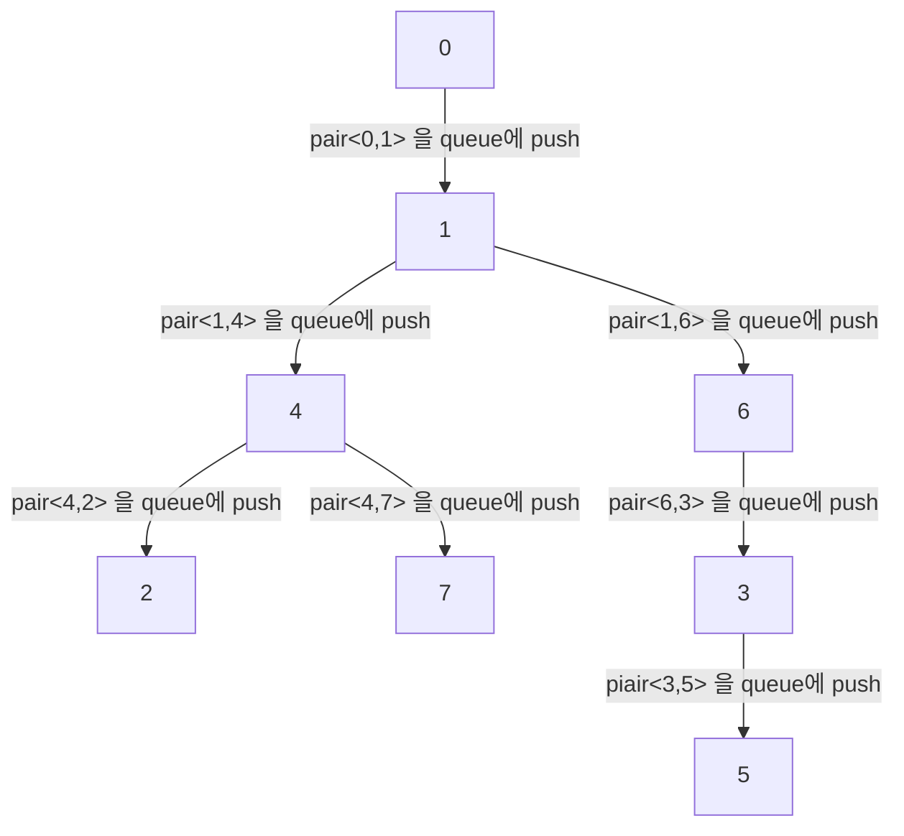

# Class 4 - 트리의 부모 찾기

## 문제

루트 없는 트리가 주어진다. 이때, 트리의 루트를 1이라고 정했을 때, 각 노드의 부모를 구하는 프로그램을 작성하시오.

## 입력

첫째 줄에 노드의 개수 N (2 ≤ N ≤ 100,000)이 주어진다. 둘째 줄부터 N-1개의 줄에 트리 상에서 연결된 두 정점이 주어진다.

## 출력

첫째 줄부터 N-1개의 줄에 각 노드의 부모 노드 번호를 2번 노드부터 순서대로 출력한다.

## 예제 입력 1

```
7
1 6
6 3
3 5
4 1
2 4
4 7

```

## 예제 출력 1

```
4
6
1
3
1
4
```

## 문제 해설



1. BFS이기 때문에 위에서 아래로 왼쪽에서 오른쪽으로 순서대로 진행됩니다.
2. pair의 구조는 (시작점, 도착점) 으로 합니다.
3. 0시작점을 사용하지 않고도 풀 수 있습니다.
    1. for문을 통해서 처음 queue삽입 시에 `graph[1].size`를 사용하면 됩니다.
4. 양방향 그래프를 이용해줘야 합니다. 1에서 4로가는 경우 입력(4,1)로 연결됐기 때문에 단방향이라면 4가 루트노드가 됩니다.

```cpp
#include <vector>
#include <iostream>
#include <algorithm>
#include <queue>

using namespace std;

void bfs(int start, vector<int> &ans, vector<vector<int>> &graph, vector<bool> &visited){
    
    queue<pair<int,int>> q;
    q.push(make_pair(start, graph[start][0]));
    while(!q.empty()){
        //crt.first가 현재 위치 crt.second가 미래 위치
        pair<int,int> crt = make_pair(q.front().first, q.front().second);
        ans[q.front().second] = q.front().first;
        visited[q.front().second] = true;
        q.pop();

        for(int i=0; i<graph[crt.second].size(); i++){
            if(visited[graph[crt.second][i]])
                continue;
            else{
                q.push(make_pair(crt.second, graph[crt.second][i]));
            }
        }
    }
}

int main(){
    ios_base::sync_with_stdio(false);
    cin.tie(NULL);
    cout.tie(NULL);
    int N;  cin >> N;

    vector<vector<int>> graph(N+1);
    vector<bool> visited(N+1, false);
    vector<int> ans(N+1);

    graph[0].push_back(1);
    for(int i=0; i<N-1; i++){
        int a,b;    cin >> a >> b;
        graph[a].push_back(b);
        graph[b].push_back(a);
    }
    bfs(0, ans, graph, visited);

    for(int i=2; i<=N; i++){
        cout << ans[i] << "\n";
    }
}
```