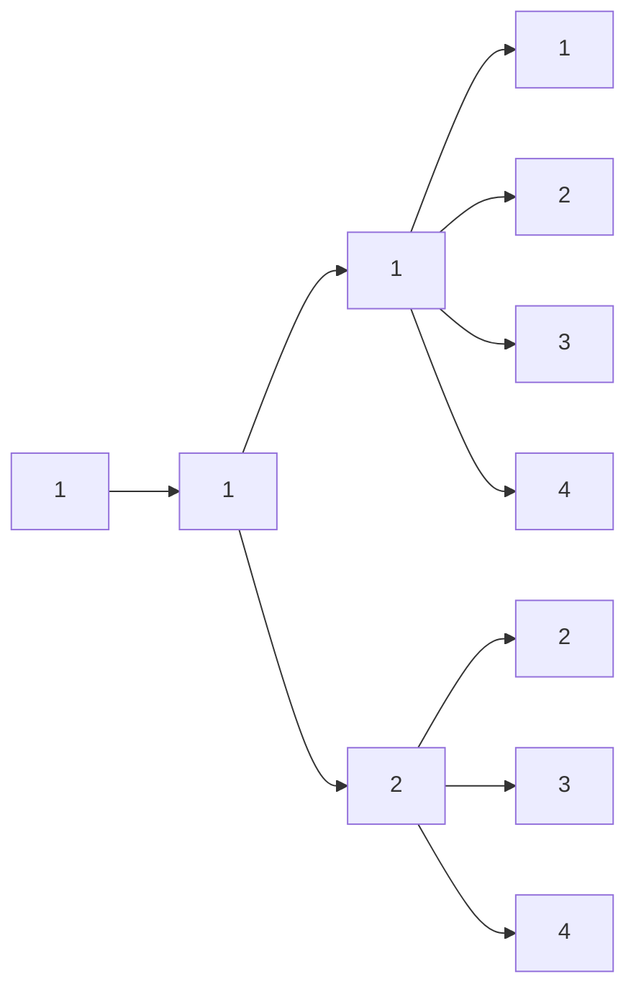
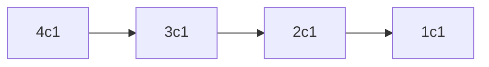

# Class 4 -N과 M(8)

생성일: 2023년 3월 21일 오후 1:26
태그: Class 4

## 문제

N개의 자연수와 자연수 M이 주어졌을 때, 아래 조건을 만족하는 길이가 M인 수열을 모두 구하는 프로그램을 작성하시오. N개의 자연수는 모두 다른 수이다.

- N개의 자연수 중에서 M개를 고른 수열
- 같은 수를 여러 번 골라도 된다.
- 고른 수열은 비내림차순이어야 한다.
    - 길이가 K인 수열 A가 A ≤ A ≤ ... ≤ A ≤ A를 만족하면, 비내림차순이라고 한다.

## 입력

첫째 줄에 N과 M이 주어진다. (1 ≤ M ≤ N ≤ 8)

둘째 줄에 N개의 수가 주어진다. 입력으로 주어지는 수는 10,000보다 작거나 같은 자연수이다.

## 출력

한 줄에 하나씩 문제의 조건을 만족하는 수열을 출력한다. 중복되는 수열을 여러 번 출력하면 안되며, 각 수열은 공백으로 구분해서 출력해야 한다.

수열은 사전 순으로 증가하는 순서로 출력해야 한다.

## 예제 입력

```
4 4
1231 1232 1233 1234

```

## 예제 출력

```
1231 1231 1231 1231
1231 1231 1231 1232
1231 1231 1231 1233
1231 1231 1231 1234
1231 1231 1232 1232
1231 1231 1232 1233
1231 1231 1232 1234
1231 1231 1233 1233
1231 1231 1233 1234
1231 1231 1234 1234
1231 1232 1232 1232
1231 1232 1232 1233
1231 1232 1232 1234
1231 1232 1233 1233
1231 1232 1233 1234
1231 1232 1234 1234
1231 1233 1233 1233
1231 1233 1233 1234
1231 1233 1234 1234
1231 1234 1234 1234
1232 1232 1232 1232
1232 1232 1232 1233
1232 1232 1232 1234
1232 1232 1233 1233
1232 1232 1233 1234
1232 1232 1234 1234
1232 1233 1233 1233
1232 1233 1233 1234
1232 1233 1234 1234
1232 1234 1234 1234
1233 1233 1233 1233
1233 1233 1233 1234
1233 1233 1234 1234
1233 1234 1234 1234
1234 1234 1234 1234
```

## 문제 해설

Visit배열이 필요하지 않은 문제다.



### dfs(start, depth)가 돌아가는 과정을 보자

start의 의미는 start부터 n까지의 수 중 1가지를 선택하게 해준다.

depth의 의미는 그렇게 1개씩 선택하다가 m가지를 선택했다면 출력하게 해준다.

이전 N과 M문제와 다른점은 **for문의 i가 start부터 시작한다.**

수열을 자세히 보면

**make[i-1]의 수가 A라면 A부터 N까지만 중복해서 사용이 가능하다.**

`for(i=0; i<n; i++)` 구조였다면 배열의 각 자리에서 n가지 수를 사용 가능하다.

하지만 `for(i=start; i<n; i++)`구조에서는 start에 0을 입력한다음 시작하고

첫 자리가 [0]인 수를 썻다면 그 다음 자리에서는 [1]부터 사용이 가능하게 된다.



## 코드

```cpp
#include <vector>
#include <iostream>
#include <algorithm>

using namespace std;

int n,m;
vector<int> arr;
vector<int> make;
vector<vector<int>> ans;

void dfs(int start, int depth){
    if(depth == m){
        ans.push_back(make);
        return;
    }
    for(int i = start; i<n ;i++){
        make[depth] = arr[i];
        dfs(i, depth + 1);
    }
}

int main(){
    ios_base::sync_with_stdio(false);
    cin.tie(NULL);
    cout.tie(NULL);
    cin >> n >> m;

    for(int i=0; i<n; i++){
        int temp;   cin >> temp;
        arr.push_back(temp);
        make.push_back(0);
    }

    sort(arr.begin(), arr.end());

    dfs(0,0);

    for(int i=0; i<ans.size(); i++){
        for(int j=0; j<m; j++){
            cout << ans[i][j] << ' ';
        }
        cout << "\n";
    }
}
```