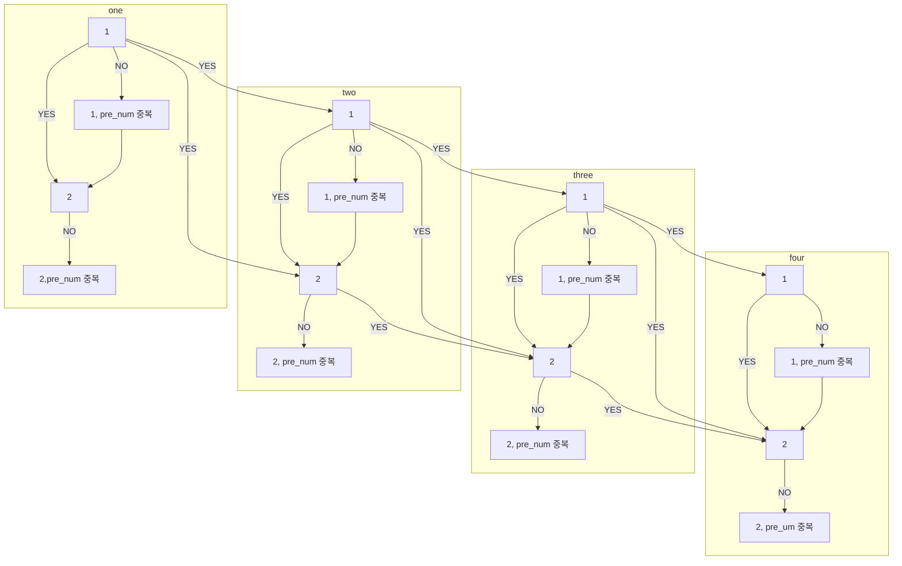

# Class 4 - N과 M(12)

## 문제

N개의 자연수와 자연수 M이 주어졌을 때, 아래 조건을 만족하는 길이가 M인 수열을 모두 구하는 프로그램을 작성하시오.

- N개의 자연수 중에서 M개를 고른 수열
- 같은 수를 여러 번 골라도 된다.
- 고른 수열은 비내림차순이어야 한다.
    - 길이가 K인 수열 A가 A ≤ A ≤ ... ≤ A ≤ A를 만족하면, 비내림차순이라고 한다.

## 입력

첫째 줄에 N과 M이 주어진다. (1 ≤ M ≤ N ≤ 8)

둘째 줄에 N개의 수가 주어진다. 입력으로 주어지는 수는 10,000보다 작거나 같은 자연수이다.

## 출력

한 줄에 하나씩 문제의 조건을 만족하는 수열을 출력한다. 중복되는 수열을 여러 번 출력하면 안되며, 각 수열은 공백으로 구분해서 출력해야 한다.

수열은 사전 순으로 증가하는 순서로 출력해야 한다.

## 예제 입력 1

```
3 1
4 4 2
```

## 예제 출력 1

```
2
4
```

## 예제 입력 2

```
4 2
9 7 9 1
```

## 예제 출력 2

```
1 1
1 7
1 9
7 7
7 9
9 9
```

## 예제 입력 3

```
4 4
1 1 2 2
```

## 예제 출력 3

```
1 1 1 1
1 1 1 2
1 1 2 2
1 2 2 2
2 2 2 2
```

## 문제해설



1. 입력이 어떻게 들어와도 sort를 하고 진행시키기 때문에 **이미 봤던 수**에 대해서는 다시 볼 필요가 없다.
2. N+1번째 열에서 본 숫자는 N번째 열에서 1번만 본다.
3. 각 열에서 같은 수는 1번만 사용하기 위해 pre_num을 이용한다. (1과 같은 맥락)
4. `dfs(i, count + 1);` N과 M(9)와 다른 점은 dfs의 형태이다.
5. (아래의 N과 M(9)와 비교해보자)
    
    [Algorithm_Code/15663 at main · JangHyoJoon-dev/Algorithm_Code](https://github.com/JangHyoJoon-dev/Algorithm_Code/tree/main/15663)
    

## 코드

```cpp
#include <vector>
#include <iostream>
#include <algorithm>

using namespace std;

int N,M;

vector<int> arr;
vector<int> make;

void dfs(int start, int count){
    if(count == M){
        for(int i=0; i<M; i++){
            cout << make[i] << ' ';
        }
        cout << "\n";
    }
    else{
        //각 열을 마다 pre_num을 지닌다.
        int pre_num = -1;
        for(int i=start; i<N; i++){
            //이번 열에서 읽었던 수는 2번 읽지 않는다.
            if(arr[i] == pre_num) {
                continue;
            }
            //처음 읽어들인 수라면 pre_num에 저장
            pre_num = arr[i];
            make[count] = arr[i];
            //진행할 때마다 사용 가능한 수를 1개씩 줄여나간다.
            dfs(i, count + 1);
        }
    }
}

int main(){
    ios_base::sync_with_stdio(false);
    cin.tie(NULL);
    cout.tie(NULL);

    cin >> N >> M;

    for(int i=0; i<N; i++){
        int temp;   cin >> temp;
        arr.push_back(temp);
        make.push_back(0);
    }
    sort(arr.begin(), arr.end());
    dfs(0,0);
}
```