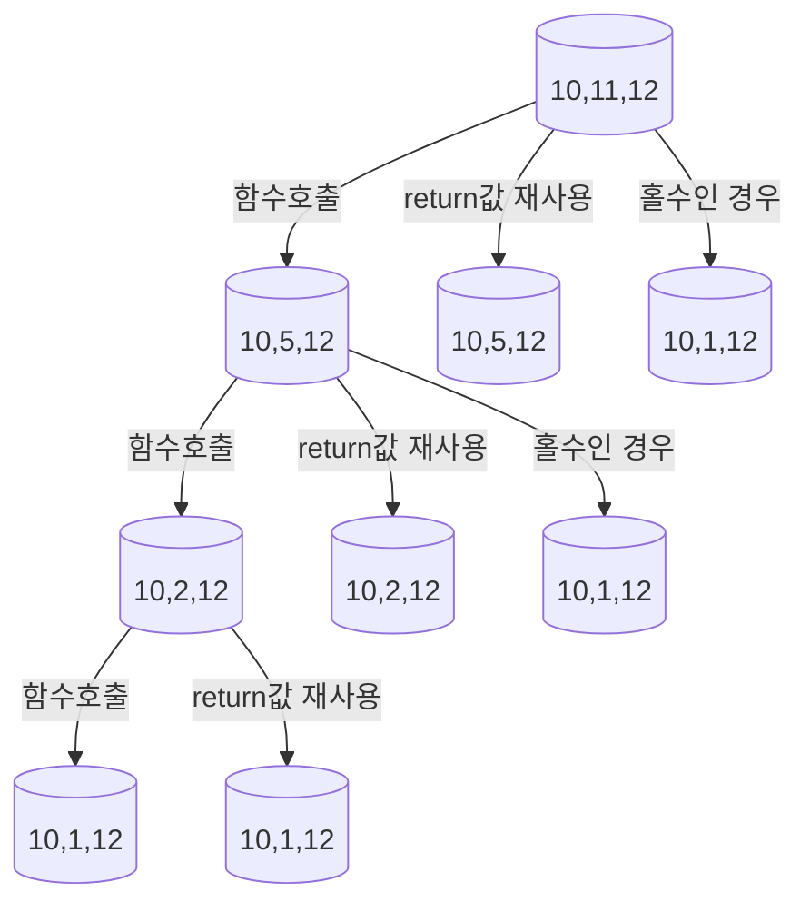

# Class 4 - 곱셈

[1629번: 곱셈](https://www.acmicpc.net/problem/1629)

## 문제

자연수 A를 B번 곱한 수를 알고 싶다. 단 구하려는 수가 매우 커질 수 있으므로 이를 C로 나눈 나머지를 구하는 프로그램을 작성하시오.

## 입력

첫째 줄에 A, B, C가 빈 칸을 사이에 두고 순서대로 주어진다. A, B, C는 모두 2,147,483,647 이하의 자연수이다.

## 출력

첫째 줄에 A를 B번 곱한 수를 C로 나눈 나머지를 출력한다.

## 예제 입력 1

```
10 11 12
```

## 예제 출력 1

```
4
```

## 문제 해설

도저히 해결할 수 없어서 결국 참고를 했다.

[[백준] 1629번 : 곱셈 [C/C++]](https://rujang.tistory.com/entry/백준-1629번-곱셈-CC)

이번 해설은 분할 정복의 과정을 도식화 하려고 한다.

앞서 문제를 해결하기 위해 필요했던 지식은

### 모듈러 성질

$$
(A \times B) \ \bmod \ C = (A \bmod C) \times (B \bmod C) 
$$

### 지수 법칙

$$
A^{(M+N)} = A^M \times A^N
$$

### 이 문제에서 위 두 성질의 활용 방법

1. $log_2n$ 으로 풀기 위해서는 지수를 반으로 나눠가면 된다.
    1. 예제 입력의 경우 (10,11 12)였으니 지수 법칙을 이용한다면 
    2. (10,5,12), (10,5,12), (10,1,12)이다.
    3. 두 개의 (10,5,12)를 각각 곱해주는 것은 모듈러 성질에 의해 참이다.
2. 이를 수식으로 도식화 한다면
    
    $$
    10^{11} \bmod 12 = [(10^5\bmod12) \times (10^5\bmod12)] \times (10^1\bmod 12)
    $$
    



B값이 1이 되면 return이 된다.

`return mid_value * mid_value % C;` mid_value를 두 번 곱하는 구조이기 때문에 그림과 같이 2번 divide하지는 않는다.

```cpp
#include <iostream>

using namespace std;

int A,B,C;

long long divide_and_conquer(long long factor){
    if(factor == 1)
        return A % C;

    long long mid_value = divide_and_conquer(factor / 2) % C;

    if(factor % 2 == 0)
        return mid_value * mid_value % C;
    else
        return mid_value * mid_value % C * A % C;
}
int main(){
    ios_base::sync_with_stdio(false);
    cin.tie(NULL);
    cout.tie(NULL);

    cin >> A >> B >> C;
    cout << divide_and_conquer(B);
}
```